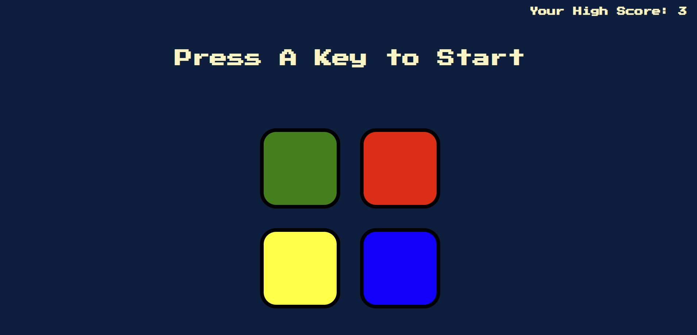

# Simon Game

This is a simple implementation of the classic Simon Game using HTML, CSS, and JavaScript.

## Table of Contents

- [Description](#description)
- [Features](#features)
- [How to Play](#how-to-play)
- [Live Demo](#live-demo)
- [Development](#development)
- [Contributing](#contributing)

## Description

The Simon Game is a memory game where players must repeat a sequence of colors in the correct order. The game gets progressively harder as the sequence grows longer with each round.

## Features

- Responsive design
- Audio feedback for button presses
- Visual feedback for correct and incorrect sequences
- High score tracking saved locally in the browser

## How to Play

- Press the `A` key on your keyboard to start the game.
- Watch the sequence of colors as they light up.
- Repeat the sequence by clicking on the colored buttons in the correct order.
- The game will continue to add one more color to the sequence each round.
- The game ends when you click the wrong color. Your score will be saved if it is the highest score you have achieved.

## Live Demo

You can play the game [here](https://CristiMCV91.github.io/SimonGame/).

## Development

- **Author**: Cristian M.
- **Version**: 1.0
- **Date**: 04.07.2024

## Contributing

Contributions are welcome! Please open an issue or submit a pull request if you would like to contribute to this project.